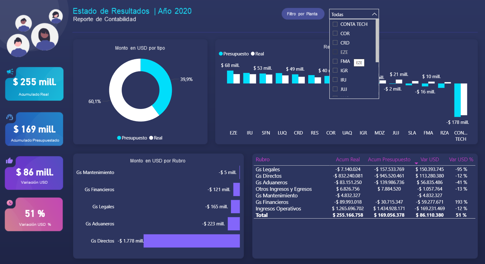

# 📊 Power BI - Estado de Resultados por Planta
Este repositorio contiene un reporte desarrollado en Power BI que muestra un Estado de Resultados contable, diseñado para facilitar el análisis financiero por planta.

## 🧾 Descripción general
El reporte permite visualizar el desempeño financiero de distintas plantas, comparando los resultados reales con los presupuestados y facilitando el análisis de desviaciones.

## 🔍 Filtro principal
Planta: Permite seleccionar una o varias plantas para visualizar resultados específicos.

## 📈 KPIs principales
El reporte destaca los siguientes indicadores clave de desempeño:

✅ Acumulado real (en millones USD)

📊 Acumulado presupuestado

🔁 Variación en USD (real vs presupuestado)

📉 Variación en porcentaje (%)

## 📊 Visualizaciones incluidas
🟢 Gráfico de torta: Monto en USD por tipo de presupuesto.

🟦 Gráfico de barras verticales: Resultado por planta.

🟨 Gráfico de barras horizontales: Monto en USD por rubro.

📋 Tabla: Muestra los siguientes campos:

Rubro

Acumulado real

Acumulado presupuestado

Variación USD

Variación USD %

## 🌄 Capturas del dashboard

  

